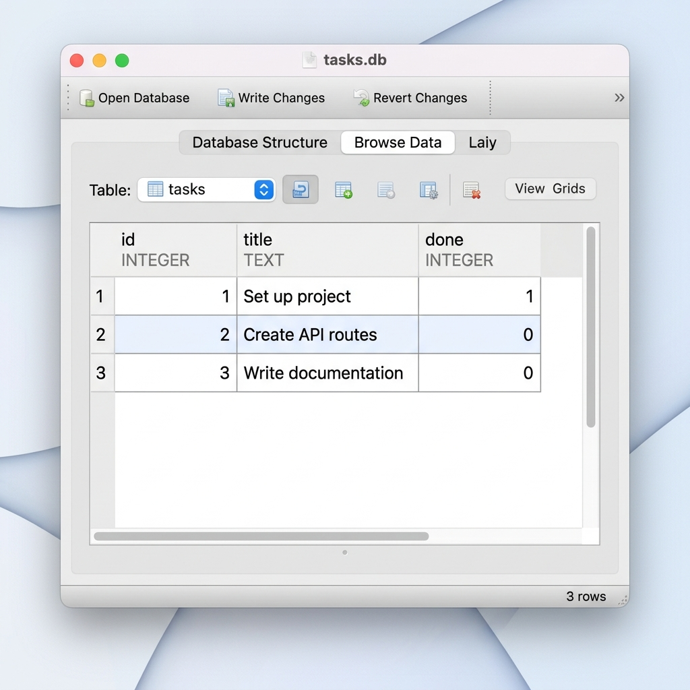
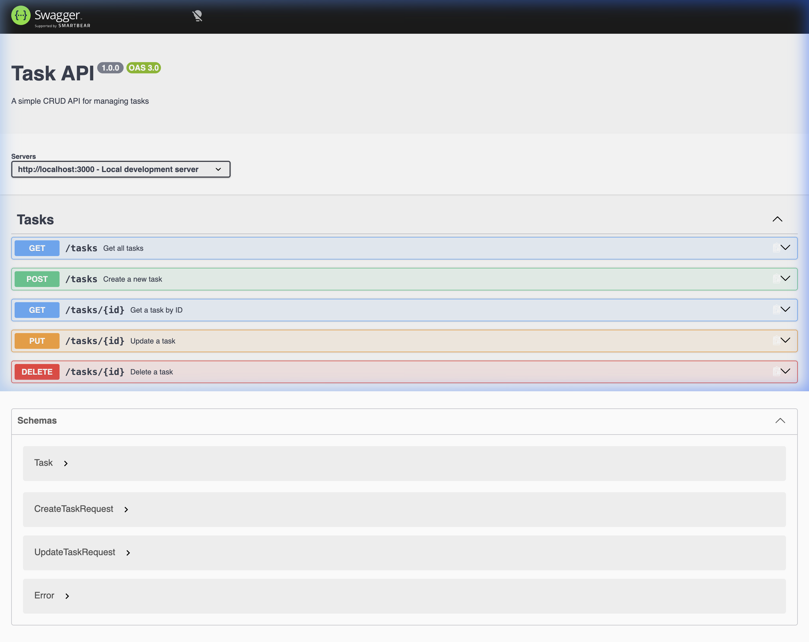

# Task API

A minimal RESTful CRUD API built with **Node.js** and **Express** for managing tasks. Data is persisted in a **SQLite** database via `better-sqlite3`. Includes input validation, proper HTTP status codes, and interactive API documentation powered by **Swagger UI**.

---

## Features

- Full CRUD operations backed by a SQLite database (`tasks.db`)
- Data persists across server restarts
- Input validation with descriptive error messages
- Interactive API docs at `/docs` via Swagger UI
- Health check endpoint

## Prerequisites

- [Node.js](https://nodejs.org/) v16 or later
- npm (bundled with Node.js)

## Installation

```bash
git clone https://github.com/RoopinNayak/FlyRank_CRUD_API.git
cd FlyRank_CRUD_API
npm install
```

## Running the Server

```bash
npm start
```

The server starts at **http://localhost:3000**. On first run, a `tasks.db` file is created automatically and seeded with 3 sample tasks.

## API Endpoints

| Method | Path | Request Body | Success | Error | Description |
|--------|------|--------------|---------|-------|-------------|
| `GET` | `/` | — | `200` | — | API info and available endpoints |
| `GET` | `/health` | — | `200` | — | Health check |
| `GET` | `/tasks` | — | `200` | — | List all tasks |
| `GET` | `/tasks/:id` | — | `200` | `404` | Get a single task by ID |
| `POST` | `/tasks` | `{ "title": "string" }` | `201` | `400` | Create a new task |
| `PUT` | `/tasks/:id` | `{ "title?": "string", "done?": boolean }` | `200` | `400` `404` | Update a task |
| `DELETE` | `/tasks/:id` | — | `204` | `404` | Delete a task |

## Example Request

```bash
curl -i http://localhost:3000/tasks
```

```
HTTP/1.1 200 OK
X-Powered-By: Express
Content-Type: application/json; charset=utf-8
Content-Length: 190
ETag: W/"be-IOch9YMhFnLtEhJ5PqxRY70kd7Q"
Date: Wed, 19 Aug 2026 08:05:52 GMT
Connection: keep-alive
Keep-Alive: timeout=5

[
  { "id": 1, "title": "Set up project", "done": true },
  { "id": 2, "title": "Create API routes", "done": false },
  { "id": 3, "title": "Write documentation", "done": false }
]
```

## SQLite Database

The API uses `tasks.db` as its **single source of truth**. Both the Express API and external tools (like DB Browser for SQLite) read and write to the same file — changes made in one are instantly visible in the other, with no server restart required.

### Useful SQL Queries

You can open `tasks.db` in [DB Browser for SQLite](https://sqlitebrowser.org/) or the `sqlite3` CLI and run these queries directly:

| Query | Description |
|-------|-------------|
| `SELECT * FROM tasks;` | View all tasks |
| `SELECT * FROM tasks WHERE done = 1;` | View only completed tasks |
| `SELECT COUNT(*) FROM tasks;` | Count total tasks |
| `UPDATE tasks SET done = 1;` | Mark all tasks as complete |
| `DELETE FROM tasks WHERE done = 1;` | Remove all completed tasks |

### Example: Direct Database Query

```sql
SELECT * FROM tasks WHERE done = 0;
```

```
id  title                 done
--  --------------------  ----
2   Create API routes     0
3   Write documentation   0
```

This returns all incomplete tasks. Because the API reads from `tasks.db` on every request, any change you make here (e.g., manually updating a `done` value in DB Browser and clicking **Write Changes**) is immediately reflected when you call `curl http://localhost:3000/tasks` — no restart needed.

### DB Browser for SQLite



## Interactive Documentation

Swagger UI is served at **http://localhost:3000/docs** — use the **Try it out** buttons to test every endpoint directly from the browser.



## Project Structure

```
├── index.js          # Express server & route handlers
├── openapi.json      # OpenAPI 3.0 specification
├── tasks.db          # SQLite database (auto-created, git-ignored)
├── package.json      # Project metadata & dependencies
├── swagger.png       # Swagger UI screenshot
├── db_browser.png    # DB Browser for SQLite screenshot
├── .gitignore        # Ignores node_modules and tasks.db
└── README.md
```

## License

ISC
